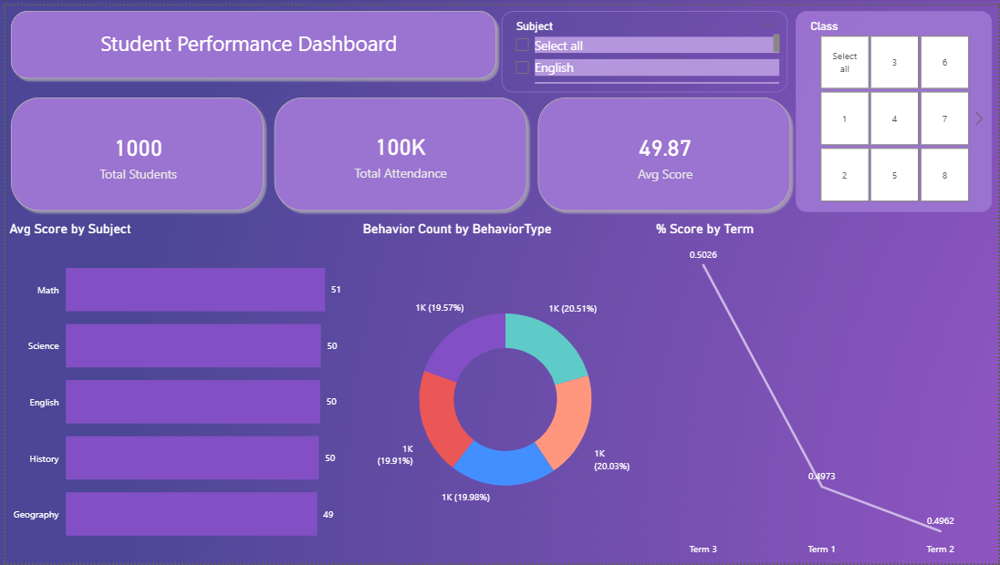

# 🎓 Student Performance Dashboard – Power BI

An interactive **Power BI dashboard** designed to analyze **academic performance, attendance, and student behavior** across multiple dimensions such as class, subject, and term.

This project was created as part of a **Practical Power BI Final Exam** to demonstrate skills in:
- Data modeling
- DAX calculations
- Interactive visualizations
- Business storytelling

---

## 📸 Dashboard Preview

---

## 🎯 Project Objective

The objective of this project is to build a **comprehensive student analytics dashboard** that helps educators and administrators:

- Track student performance by subject and term  
- Monitor attendance trends  
- Analyze behavioral patterns  
- Identify high, medium, and low performers  

---

## 🗂️ Dataset Information

The project uses the following datasets:

| File Name | Description |
|---------|------------|
| **Students.csv** | Student details (ID, Name, Gender, Class, Section) |
| **Scores.csv** | Academic scores by subject, exam type, and term |
| **Attendance.csv** | Daily attendance records |
| **Behaviour.csv** | Behavioral incidents with notes |

> Raw data is included in `raw-data.xlsx`

---

## 🧱 Data Model

- Star schema design
- `Students` table as the **dimension table**
- `Scores`, `Attendance`, and `Behaviour` as **fact tables**
- Relationships based on `StudentID`

---

## 📐 Key DAX Measures

- Total Students  
- Average Score  
- Attendance %  
- Behavior Count  
- % Score  
- Performance Category (High / Medium / Low using SWITCH)

---

## 📊 Dashboard Features

### KPIs
- Total Students
- Total Attendance
- Average Score

### Visualizations
- 📊 Average Score by Subject (Bar Chart)
- 🍩 Behavior Count by Type (Donut Chart)
- 📈 % Score Trend by Term (Line Chart)
- 📋 Student-wise performance table with conditional formatting

---

## 🎛️ Interactivity

- Slicers for **Class**, **Subject**, **Term**
- Drillthrough for **Student-level analysis**
- Tooltips for quick insights
- Clean and modern UI theme

---

## 💡 Key Insights

- Higher attendance correlates strongly with better academic performance  
- Students with frequent disruptive behavior generally show lower scores  
- Performance varies slightly across terms, highlighting improvement opportunities  

---

## 📁 Project Files

